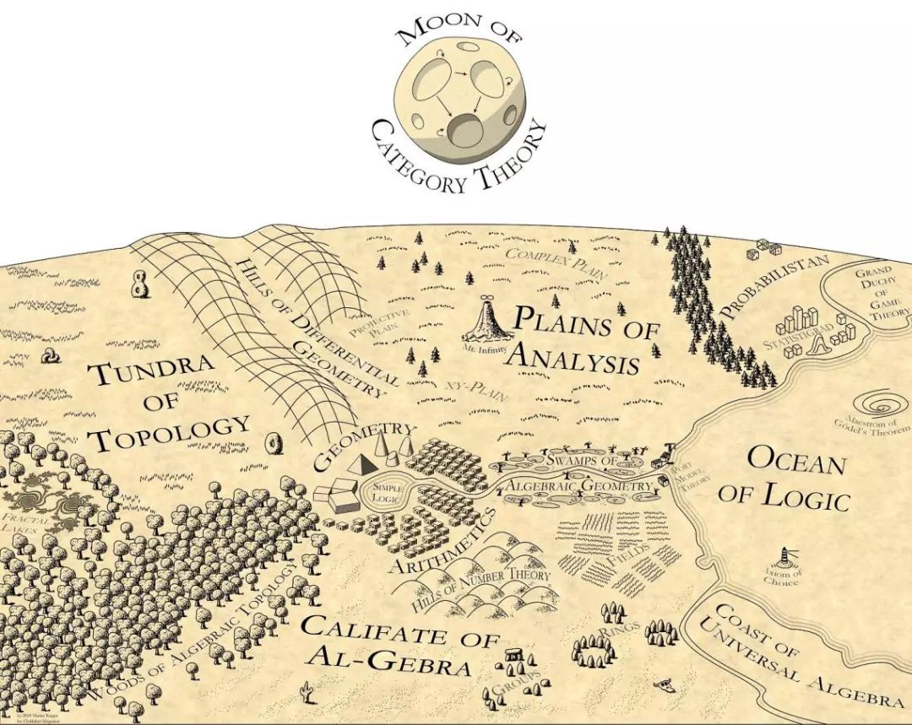

# Hi there 👋, I'm Shengtang Jia. Welcome to my GitHub profile!

I'm an undergraduate student majoring in **Mathematics and Applied Mathematics**, with a strong passion for **Pure Mathematics** — especially **Algebra**.

📚 I also write about mathematics on **Zhihu**: [Xigmatau](https://www.zhihu.com/people/Xigmatau) — articles and answers on math topics.

  

## 🎓 Education
- **Shenzhen MSU-BIT University (МГУ-ППИ)** — *B.S. candidate*  
  *Computational Mathematics and Cybernetics (Факультет вычислительной математики и кибернетики, ВМК)*  
  Major: **Mathematics and Applied Mathematics *(Прикладная математика и информатика)***  
  **2023 – 2027 (expected)**  
  Website: [Shenzhen MSU-BIT University](https://en.smbu.edu.cn/)

## 🔍 Research Interests
- **Commutative Algebra**
- **Algebraic Number Theory**
- Related topics in **Algebra** and **Pure Mathematics**

## 🛠️ Skills / Tools
- **C / C++**
- **Python**
- **LaTeX**

## 📫 Contact
- Email1 (School): [1120230002@smbu.edu.cn](mailto:1120230002@smbu.edu.cn)
- Email2 (QQ): [3065842149@qq.com](mailto:3065842149@qq.com)
- Email3 (Gmail): [shengtangjia@gmail.com](mailto:shengtangjia@gmail.com)

---

Thanks for stopping by. Feel free to explore my repositories and reach out if you'd like to discuss mathematics!
